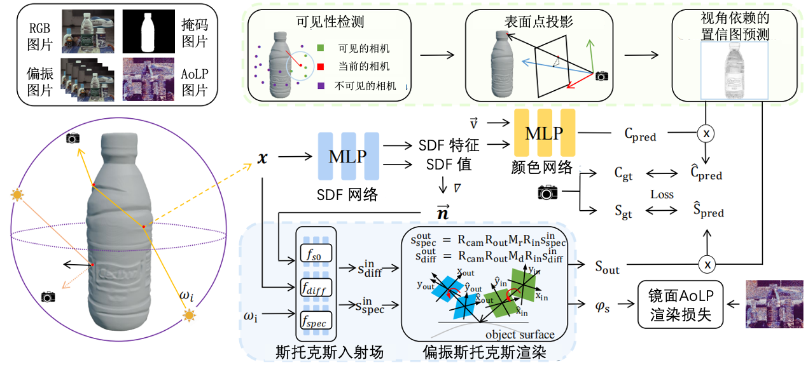

# PIR-VPR

This is the official repo for the implementation of "High-Fidelity Polarimetric Implicit 3D Reconstruction with View-Dependent Physical Representation" paper (AAAI 2025).

### Usage

#### Data Convention

The data is organized as follows:

<case_name>
|-- cameras_xxx.npz    # camera parameters
|-- I-sum
    |-- 000.png        # target image for each view
    |-- 001.png
    ...
|-- I-00
    |-- 000.png        
    |-- 001.png
    ...
|-- I-45
    |-- 000.png        
    |-- 001.png
    ...
|-- I-90
    |-- 000.png        
    |-- 001.png
    ...
|-- I-135
    |-- 000.png        
    |-- 001.png
    ...
|-- masks
    |-- 000.png        # target mask each view (For unmasked setting, set all pixels as 255)
    |-- 001.png
    ...
|-- params
    |-- AOLP        # target AOLP and DOLP each view (For unmasked setting, set all pixels as 255)
    |-- DOLP

### Setup

Dependencies (click to expand):

- python==3.10
- torch==2.0.0
- cuda==11.8
- torch3d
- trimesh

### Running

- Stage1 Training

cd ./MVSS/mvss-idr-t/code
python training/exp_runner.py

- Stage2 and Stage3 Training

cd ./MVSS/mvss-stage23/code
python training/exp_runner.py

The final results are saved in the exps/{object_name} folder.

### Train PIR-VPR with your custom data

Place your object in the dtu folder. More information will be updated later.

## Citation

Cite as below if you find this repository is helpful to your project:

@article{yariv2020multiview,
  title={Multiview neural surface reconstruction by disentangling geometry and appearance},
  author={Yariv, Lior and Kasten, Yoni and Moran, Dror and Galun, Meirav and Atzmon, Matan and Ronen, Basri and Lipman, Yaron},
  journal={Advances in Neural Information Processing Systems},
  volume={33},
  pages={2492--2502},
  year={2020}
}

@article{shao2024polarimetric,
  title={Polarimetric inverse rendering for transparent shapes reconstruction},
  author={Shao, Mingqi and Xia, Chongkun and Duan, Dongxu and Wang, Xueqian},
  journal={IEEE Transactions on Multimedia},
  year={2024},
  publisher={IEEE}
}

## Acknowledgement

Some code snippets are borrowed from [IDR](https://github.com/lioryariv/idr), [NEISF](https://github.com/sony/NeISF) and [PIR](https://github.com/shaomq2187/TransPIR). Thanks for these great projects.